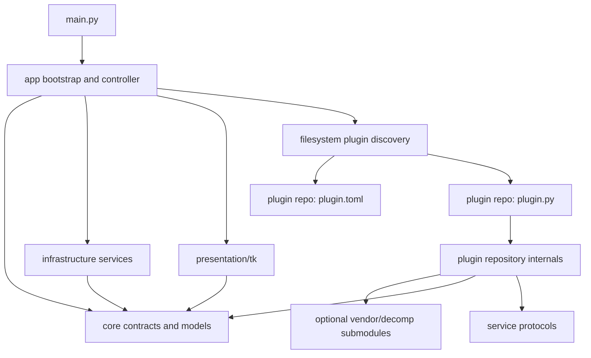

# Filesystem Plugin Architecture Plan

Status: migration started

Decision: RetroArch Overlay is a blank application harness. Every game integration is a standalone Git repository loaded directly from the filesystem. A separate trusted catalog manifest advertises available repositories. The startup repository manager may invoke bounded Git clone and fast-forward update operations; Python package publication, wheel distribution, `pipx` injection, namespace packages, and Python entry points are outside the design.

Implemented in the first slice:

- dependency-free core RA and snapshot/protocol models with compatibility re-exports
- shared keyring credential store under `infrastructure`
- Tk API-key prompt under `presentation/tk`
- RA HTTP/config implementation under `infrastructure`
- an initial internal sibling-folder discovery prototype with isolated failures; this must be replaced by external repository discovery
- external `plugin.toml` repository discovery with strict validation and isolated lazy loading
- Pokemon Emerald extracted to `JEschete/RAO_pokeemerald` with `pret/pokeemerald` pinned under `vendor/pokeemerald`
- Emerald code, tests, and game-specific resources removed from the core repository
- architecture tests for the first game/core import rules
- hash-driven, public-Web-API achievement research export with offline saved-page memory-note import

Still pending: extracting Dragon Warrior III into `RAO_dragonwarrior3`, generic map documents, the catalog-backed startup repository manager, controller/UI separation, and removal of remaining compatibility modules.

## Goal

Turn RetroArch Overlay into a stable blank harness around selectively cloned, self-contained game plugin repositories.

The defining acceptance rule is:

> Adding a game requires cloning one standalone Git repository into a discovered plugin directory. It requires no edits to `main.py`, shared UI code, the registry, project metadata, or a central game list.

All source-controlled game knowledge must live in that plugin repository. This includes ROM identity, RAM addresses, state decoders, achievement IDs, progression rules, maps, images, patches, fixtures, game-specific setup options, and any pinned decomp submodules.

## Architectural Decisions

1. The main repository contains no games. It provides only the application harness, contracts, infrastructure, generic presentation, filesystem plugin discovery, and diagnostics.
2. Each game plugin is a standalone Git repository. A plugin repository is a complete vertical slice, not only a memory adapter.
3. Discover plugins by scanning configured filesystem directories for repository roots containing `plugin.toml` and `plugin.py`. Do not maintain named imports or a central registry list.
4. Load each plugin's lightweight `plugin.py` in an isolated module namespace derived from its manifest ID. Construct the adapter lazily only after its manifest matches active content.
5. The default plugin directory is `<core-repository>/plugins/`. It is ignored by the core repository so each child remains independently versioned. Additional roots may be supplied with repeatable `--plugin-dir` arguments.
6. Git is the plugin installation and update mechanism. The startup repository manager may clone a user-selected catalog entry with `--recurse-submodules` and update a clean checkout with `pull --ff-only` followed by recursive submodule synchronization. It must never auto-install, force-update, reset, merge, or delete a repository.
7. A plugin may pin a game decomp under `vendor/` as a Git submodule. `git clone --recurse-submodules` is the standard acquisition path for such plugins.
8. A plugin import must not require its submodules. Submodule/data validation occurs only when matching content causes lazy adapter construction.
9. Keep all communication between a plugin and the application in shared, immutable data contracts.
10. Keep Tk, sockets, HTTP, keyring, filesystem search, and command-line parsing out of plugin domain modules.
11. Keep every source-controlled game asset inside the owning plugin repository and resolve it relative to that repository root.
12. A missing, incomplete, or broken plugin must not prevent the blank harness or another plugin from starting.
13. Preserve compatibility imports during extraction, then remove all game code from the core repository.
14. Enforce these boundaries with automated architecture and plugin contract tests rather than relying only on documentation.
15. Available-plugin knowledge lives in a separately versioned catalog, not in core source or application configuration. Installed-plugin truth always comes from each local repository's validated `plugin.toml`.

## Target Dependency Direction



The following imports are forbidden:

- `core` importing `app`, `infrastructure`, `presentation`, or plugin code.
- `infrastructure` importing `presentation` or any plugin repository.
- `presentation` importing a named plugin.
- `app` importing a named plugin.
- One plugin importing another plugin.
- A plugin importing Tk, keyring, socket, or application HTTP implementations.
- Shared code containing a path to a named game's assets.
- The core repository containing a ROM hash, memory address, achievement ID, map calibration, game title alias, or decomp rule.

## Target Project Layout

```text
RetroArchOverlay/                         # main/core Git repository
    .git/
    .gitignore                            # ignores plugins/*
    ARCHITECTURE_PLAN.md
    plugins/                              # discovery root, not tracked by core
        RAO_pokeemerald/                  # independent Git plugin repository
        RAO_dragonwarrior3/               # independent Git plugin repository
    src/retroarch_overlay/
        __init__.py
        main.py
        app/
            bootstrap.py
            controller.py
            options.py
            diagnostics.py
        core/
            contracts.py
            errors.py
            models.py
            presentation.py
        infrastructure/
            content_hashes.py
            plugin_loader.py
            retroarch.py
            retroachievements.py
            credentials.py
            app_paths.py
        presentation/
            tk/
                overlay.py
                details.py
                maps.py
                credentials.py
    tests/
        architecture/
        app/
        infrastructure/
        presentation/
```

The `plugins/` children shown above are separate repositories, not tracked directories or submodules of the core repository. The core repository remains useful and runnable when `plugins/` is empty or absent.

## Shared Boundary Responsibilities

### Core

`core` contains only stable types and protocols:

- `RetroArchStatus`
- `MemoryReader`
- `GameManifest`
- `GamePlugin`
- `GameAdapter`
- `GameContext`
- `GameOptionSpec`
- `OverlaySnapshot`
- `PanelSection`
- `PanelRow`
- action and detail document models
- generic map document models
- typed application errors

Core must depend only on the Python standard library. It cannot know which games exist.

### Application

`app` coordinates the program:

- discovers plugins
- builds the generic command-line parser
- resolves shared and plugin-declared settings
- starts infrastructure services
- polls RetroArch
- selects and caches the matching game adapter
- converts exceptions into diagnostic events
- sends immutable render models to the UI

The polling thread currently inside `OverlayWindow` moves to `app/controller.py`. The Tk renderer should receive events and render them; it should not own sockets, registry selection, or retry policy.

### Infrastructure

`infrastructure` implements external I/O:

- RetroArch UDP commands and memory reads
- ROM hashing and filesystem search
- RetroAchievements HTTP calls
- credential persistence
- operating-system data/cache paths

Infrastructure implements core protocols. It must not contain game IDs, ROM hashes, memory offsets, game-specific asset paths, or progression rules.

### Presentation

`presentation/tk` renders generic documents:

- overlay snapshots
- section actions
- detail documents
- generic image maps
- diagnostics and setup status
- credential prompts

The renderer may style a semantic state such as `alert`, `complete`, or `unavailable`. It must not branch on a game slug, game title, map ID, item ID, or achievement ID.

### Plugins

Each standalone plugin repository owns one game's complete behavior and source-controlled data. It may import core contracts and service protocols exposed through the plugin context, but not service implementations or Tk widgets.

## Plugin Repository Contract

### Repository Layout

Every plugin repository follows this shape:

```text
RetroArchOverlay-<Game>/
    .git/
    .gitignore
    .gitmodules                         # only when the plugin uses submodules
    LICENSE.md
    README.md
    plugin.toml                         # parsed without executing Python
    plugin.py                           # lightweight adapter factory
    game/
        __init__.py
        adapter.py
        state.py
        memory.py
        presenter.py
        tracker.py
        achievements.py
        knowledge.py
        data/
        assets/
    tests/
        test_plugin.py
        test_memory.py
        test_presenter.py
        fixtures/
    vendor/
        <optional-decomp-submodule>/
```

Only `plugin.toml`, `plugin.py`, `game/`, and `tests/test_plugin.py` are structurally required. Other files and folders exist when the game needs them.

### Responsibility Modules

- `plugin.py`: lightweight factory and plugin boundary implementation.
- `game/state.py`: immutable typed state objects.
- `game/memory.py`: RAM/SRAM addresses, validation, and byte decoding.
- `game/presenter.py`: game state plus knowledge to shared presentation documents.
- `game/tracker.py`: differences between snapshots and session-only observations.
- `game/knowledge.py`: small authored facts represented as typed Python data.
- `game/achievements.py`: achievement catalog and game-specific detectors.
- `game/data/`: larger authored JSON or binary tables.
- `game/assets/`: maps, patches, images, and source/license metadata.
- `tests/fixtures/`: compact memory and external-data fixtures.
- `vendor/`: Git submodules for decomps or other upstream source trees.

### Internal Dependency Direction

```text
plugin.py -> game/adapter -> game/memory -> game/state
                  -> tracker -> state
                  -> presenter -> state + knowledge + core presentation models
knowledge -> data files
presenter -> achievements
```

`memory.py` must not produce display strings or `PanelSection` objects. `presenter.py` must not read raw memory. `knowledge.py` must not perform network or emulator I/O. `adapter.py` should coordinate these pieces and remain small.

## Manifest and Plugin Contracts

### `plugin.toml`

Discovery parses `plugin.toml` with the standard-library `tomllib` module before importing Python. A representative manifest is:

```toml
schema_version = 1
plugin_id = "org.jeschete.retroarch-overlay.pokeemerald"
slug = "pokeemerald"
name = "Pokemon Emerald"
api_version = 1
entry = "plugin.py"
ra_game_id = 668

[match]
cores = ["mgba", "game_boy_advance"]
content_hints = ["emerald"]
hashes = ["31446456df04356cb9f2145bada42ed2"]

[[sources]]
id = "pokeemerald"
kind = "git-submodule"
path = "vendor/pokeemerald"
required = true
required_files = [
    "src/data/wild_encounters.json",
    "data/maps/map_groups.json",
]
```

Manifest rules:

- `plugin_id` is globally stable and must not depend on the checkout folder name.
- `slug` namespaces settings, cache entries, diagnostics, and synthetic module names.
- `api_version` must match a core-supported plugin contract version.
- `entry` must remain inside the repository root after path resolution.
- Match metadata must be sufficient to select a plugin without importing it.
- Source declarations describe generic preflight checks; game-specific semantic validation remains in plugin code.
- Unknown schema or API versions make the plugin unavailable, not fatal to the harness.

### `plugin.py`

After a manifest matches active content, the loader imports `plugin.py` under an isolated synthetic module namespace. This is an in-process import detail, not installation or package management. Its semantic contract is:

```python
class GamePlugin(Protocol):
    def create(
        self,
        context: GameContext,
    ) -> GameAdapter: ...


PLUGIN: GamePlugin
```

`GameContext` provides the repository root, resolved namespaced settings, shared service protocols, and lazy RA progress access. It does not expose Tk widgets or infrastructure implementations.

Rules for `plugin.py`:

- Import must be cheap and side-effect free.
- Do not validate submodules, parse game data, contact RA, inspect ROM directories, or construct the adapter at import time.
- Import heavy game internals inside `create()`.
- Read options and source requirements from the supplied context; declarations live in `plugin.toml`.
- Resolve files relative to `context.repository_root`, never the process working directory or core repository.
- Do not mutate `sys.path` globally.
- Do not import another plugin repository.

## Discovery and Adapter Lifecycle

1. Resolve discovery roots from the core-relative default `plugins/`, repeatable `--plugin-dir` arguments, and persisted application configuration.
2. Scan only immediate child directories of each discovery root. Do not recursively execute arbitrary Python files.
3. Treat a child as a candidate only when it contains `plugin.toml`.
4. Parse and validate manifests without importing Python.
5. Reject duplicate `plugin_id` values, duplicate slugs, conflicting option flags, path escapes, unsupported API versions, and malformed manifests.
6. Record every invalid candidate in diagnostics and continue discovering siblings.
7. Poll RetroArch and resolve the active content hash.
8. Rank manifest matches: exact hash first, then explicit core plus content hints. Ambiguous matches are reported rather than resolved by directory order.
9. Only after a match, preflight required submodule paths and import that repository's `plugin.py`.
10. Load it under a synthetic module namespace derived from the manifest slug and plugin ID so relative imports work without modifying global import paths.
11. Validate the exported `PLUGIN`, construct it with `GameContext`, and cache the adapter by plugin ID for the process lifetime.
12. If import or construction raises `GameUnavailableError`, record the reason and keep the harness operational.
13. Allow an explicit retry after configuration or submodules become available.
14. When active content changes, retain cached adapters but activate only the newly matching one.

No Python entry-point discovery, package metadata, package installation, or plugin import from `site-packages` is part of this design.

## Plugin Catalog and Startup Repository Manager

The application opens a repository manager before the overlay on every normal startup. The manager compares local filesystem discovery with one or more configured trusted catalog manifests and presents these states generically:

- available to install
- installed
- update available
- local changes present
- unavailable or invalid
- catalog identity mismatch

The user may continue to the blank overlay without installing anything. Catalog, network, and Git failures are diagnostics and never prevent startup.

The default catalog is a separately versioned repository owned by the application maintainer. Additional catalog URLs or local catalog files may be configured. Core contains only the default catalog location, cache policy, schema parser, and generic repository UI; it contains no catalog entries or game IDs.

A representative `catalog.toml` is:

```toml
schema_version = 1

[[plugins]]
plugin_id = "org.jeschete.retroarch-overlay.pokeemerald"
slug = "pokeemerald"
name = "Pokemon Emerald"
repository = "https://github.com/JEschete/RAO_pokeemerald.git"
web_url = "https://github.com/JEschete/RAO_pokeemerald"
```

Catalog rules:

- `plugin_id` is the stable join key between a catalog entry and installed `plugin.toml`.
- The catalog supplies acquisition metadata only. It does not supply ROM hashes, RAM addresses, options, assets, or runtime matching rules.
- After clone, the local `plugin.toml` must match the catalog `plugin_id` and slug before the checkout is considered installed.
- Catalog downloads use an application cache and may fall back to stale validated content when offline.
- Repository URLs must use an allowed HTTPS Git host unless the user explicitly adds a trusted local catalog.
- Git commands use argument arrays with a fixed executable and fixed verbs; catalog strings are never evaluated by a shell.
- Clone targets must be new children of a configured plugin root and may not escape that root.
- Update is offered only for a recognized checkout with no tracked or untracked changes and a fast-forward remote update.
- The manager may open the repository web page. Repository deletion is outside the initial manager scope.
- No install or update occurs without an explicit user action.

The startup sequence is:

1. Resolve plugin roots and trusted catalog locations from application configuration and CLI overrides.
2. Discover and validate local `plugin.toml` files without importing plugin Python.
3. Load cached catalogs, refresh them with a bounded network request, and retain stale validated data on failure.
4. Inspect installed Git repositories with bounded read-only commands.
5. Render repository states and diagnostics in the startup manager.
6. Execute only an explicitly selected install or eligible fast-forward update.
7. Rediscover local manifests after each successful Git operation.
8. Continue to normal manifest matching, lazy loading, and overlay startup.

## Plugin Repository Location

The normal checkout layout is:

```text
C:/Projects/Personal/RetroArchOverlay/                       # core repo
C:/Projects/Personal/RetroArchOverlay/plugins/
C:/Projects/Personal/RetroArchOverlay/plugins/RAO_pokeemerald/   # plugin repo
```

Example acquisition:

```powershell
git clone https://github.com/JEschete/RetroArchOverlay.git
git clone --recurse-submodules `
    https://github.com/JEschete/RAO_pokeemerald.git `
    .\RetroArchOverlay\plugins\RAO_pokeemerald
```

The core repository ignores everything under `plugins/` except an optional placeholder/readme. It never treats plugin repositories as its own submodules.

Additional repositories may live elsewhere:

```powershell
python .\src\retroarch_overlay\main.py `
    --plugin-dir D:\RetroArchOverlayPlugins
```

`--plugin-dir` points to a discovery root whose immediate children are plugin repositories. It is repeatable. A future `--plugin-repo` option may target one repository directly, but implicit recursive filesystem scanning is prohibited.

## Repository Ownership

The intended repository topology is:

```text
JEschete/RetroArchOverlay                  # blank core harness
JEschete/RAO_dragonwarrior3  # one game plugin
JEschete/RAO_pokeemerald     # one game plugin plus pokeemerald submodule
```

Each repository has its own history, issues, releases, tests, license, and update cadence. The core repository does not aggregate plugin source through Git submodules. A plugin may aggregate only the upstream decomps or data sources that it directly owns as dependencies.

## Configuration Boundary

`main.py` must expose only application-wide options such as host, port, opacity, ROM roots, plugin discovery roots, config path, and diagnostics.

Game options are declared in each repository's `plugin.toml`. After manifest discovery, the app translates those declarations into CLI arguments and resolved settings. For example, the Emerald repository owns its decomp-root override; `main.py` does not contain `pokeemerald`, an Emerald option, or an Emerald import.

Configuration precedence should be:

1. explicit CLI option
2. environment variable
3. user configuration file
4. manifest default

Use stable namespaced keys such as `emerald.decomp_root`. Validate generic types in the application and game-specific semantics in the plugin.

The shared application configuration may remember plugin discovery roots and trusted catalog locations, but it must not contain a list of known plugin IDs. Installed-plugin discoverability comes from the filesystem on each launch; available-plugin discoverability comes from validated catalogs.

## Presentation and Action Boundary

The current `PanelAction` is safe because it carries data rather than a callback, but `rows` is too narrow for maps and richer tools. Evolve it into a generic document action:

```text
PanelAction
    label
    document: DetailDocument | MapDocument

DetailDocument
    title
    sections

MapDocument
    title
    layers
    active_layer
    marker
    viewport
```

Plugins construct these shared documents. The Tk layer decides how to render them. Do not allow plugins to pass callables, Tk classes, or arbitrary widget factories through the contract.

The existing Dragon Warrior III map window must become a generic map renderer. The following currently game-specific UI facts move into the Dragon Warrior III repository:

- world and underworld image references
- map titles
- coordinate transforms
- border calibration
- initial layer selection
- indoor-map fallback text, if it is game-specific

The generic renderer receives already-calculated marker and viewport data. It does not import the plugin or inspect the game name.

## Game Data and Asset Policy

Game-specific data includes:

- memory addresses and bit masks
- item, monster, class, location, and map names
- ROM hashes and core/content aliases
- achievement IDs and descriptions
- route, progression, and unlock rules
- map coordinates and projection calibration
- decomp parsing rules
- images, patches, and source attribution
- test fixtures containing game-specific memory layouts

All of it belongs inside the owning standalone plugin repository.

Specific moves:

- `resources/dragon_warrior_3/*` to `RAO_dragonwarrior3/game/assets/maps/`.
- `resources/24186-PokemonEmerald-Subset-POC/*` to `RAO_pokeemerald/game/assets/patches/professor_oak_challenge/`.
- Dragon Warrior III map loading and calibration out of `ui.py`.
- Emerald's `--pokeemerald-root` declaration out of `main.py`.
- All RA game IDs out of `main.py` and into manifests.
- Game-specific examples in shared protocol tests replaced with neutral example names.

The loader supplies an absolute, validated `repository_root` in `GameContext`. Plugins resolve `game/data`, `game/assets`, and `vendor` paths from that root. Paths declared in manifests are normalized and rejected if they escape the repository root.

No plugin asset is copied into the core repository or a Python installation. Git tracks assets in the plugin repository, and normal filesystem reads load them in place. Each plugin owns attribution and license documentation for its assets and vendored sources.

## External Data Policy

Decomps and similar upstream source trees belong to the plugin that consumes them. When a game has a suitable decomp, the plugin repository pins it as a Git submodule under `vendor/`.

Emerald's expected repository layout is:

```text
RAO_pokeemerald/
    .gitmodules
    plugin.toml
    plugin.py
    game/
    tests/
    vendor/
        pokeemerald/                  # pinned Git submodule
```

Its `.gitmodules` entry is equivalent to:

```ini
[submodule "vendor/pokeemerald"]
    path = vendor/pokeemerald
    url = https://github.com/pret/pokeemerald.git
```

The gitlink in the plugin repository pins the tested decomp commit. Do not track a moving decomp branch as the compatibility contract. Updating the decomp means deliberately advancing the gitlink, rebuilding generated fixtures/cache if applicable, running tests, and reviewing the change in the plugin repository.

The standard clone workflow is:

```powershell
git clone --recurse-submodules `
    https://github.com/JEschete/RAO_pokeemerald.git `
    .\plugins\RAO_pokeemerald
```

For an existing or shallow plugin checkout:

```powershell
git -C .\plugins\RAO_pokeemerald submodule update --init --recursive
```

Rules for submodule-backed plugins:

- Discovery reads only `plugin.toml`; it does not require initialized submodules.
- Manifest matching uses ROM identity and does not parse the decomp.
- Required source validation happens only when that plugin is selected for active content.
- A missing submodule produces `GameUnavailableError` with the plugin repository path and exact `git -C <repo> submodule update --init --recursive` recovery command.
- The error appears in application diagnostics; it never terminates the harness or disables other plugins.
- Plugins may accept an explicit external decomp-path override, but their own pinned `vendor/<decomp>` is the default and tested source.
- Normal discovery, matching, activation, and overlay runtime never modify a plugin or its submodules. The startup repository manager may initialize or synchronize pinned submodules only during an explicit user-selected install or eligible fast-forward update.
- Recursive submodules are supported by the documented Git command.

Keep compact fixtures in the plugin repository so normal unit tests do not require the full submodule. Full-decomp consistency tests are separate and run after `--recurse-submodules` acquisition.

### Derived Data Cache

A plugin may normalize expensive decomp data into a local cache, but the cache is disposable and not an acquisition mechanism. The cache key must include:

- plugin data-schema version
- plugin repository revision when available
- decomp submodule revision

The plugin owns parsing and cache schema. Shared infrastructure may provide cache-directory and atomic-file protocols. Deleting the cache must only cost startup time; the pinned submodule remains authoritative.

## RetroAchievements Boundary

Split the current combined RA module into:

- core `RAProgress` model and provider protocol
- infrastructure HTTP client
- infrastructure credential store
- Tk credential prompt

`GameContext` exposes a lazy `RAProgressProvider`. A plugin requests progress using its own manifest's `ra_game_id`. `main.py` must not call `load_ra_progress` once per named game.

Network failure returns typed unavailable/stale progress rather than failing adapter construction. Game achievement catalogs and local detector rules remain inside each plugin repository.

## Runtime and Error Boundary

Introduce typed errors:

- `GameUnavailableError`: required game provider or compatible data is missing.
- `UnsupportedContentError`: manifest matched weakly but content is not supported.
- `MemoryLayoutError`: required memory values are invalid for the expected game state.
- `AssetUnavailableError`: a declared plugin-repository asset cannot be resolved.
- existing RetroArch transport/protocol errors remain infrastructure errors.

The application controller converts these into generic diagnostic models. The UI renders the diagnostics without knowing the game that produced them beyond manifest display text.

One broken game must never break discovery of its siblings. Discovery errors are collected and displayed in a diagnostics screen.

## Testing Strategy

### Harness Tests

Keep shared tests under top-level `tests/`:

- RetroArch protocol parsing
- hash resolution
- filesystem manifest discovery and duplicate detection
- isolated path-based Python loading
- plugin root and manifest path-containment validation
- missing, malformed, and partially initialized plugin repositories
- controller polling/retry behavior
- generic action/detail/map rendering helpers
- credential and RA client behavior
- plugin asset and submodule preflight resolution

Use neutral fake game names in these tests.

### Plugin Repository Tests

Move game-specific tests into each standalone plugin repository. Each plugin owns:

- memory decoder tests with byte fixtures
- presenter snapshot tests from typed state
- tracker transition tests
- manifest identity tests
- plugin construction and unavailable-provider tests
- knowledge consistency tests
- asset and attribution checks
- optional emulator/decomp-submodule integration tests

Presenter tests should not need an emulator. Memory tests should not construct UI sections. This makes failures identify the broken boundary.

The core repository provides a contract-test runner that accepts a plugin repository path. Plugin repositories may call that runner with a sibling core checkout; they are never installed into Python. A representative development command is:

```powershell
python ..\RetroArchOverlay\tools\test_plugin.py .
```

Plugin-local tests may set `PYTHONPATH` to the core repository's `src/` directory or invoke the core test runner. Neither path installs or publishes the plugin.

### Architecture Tests

Add AST-based tests that fail when:

1. shared code imports a named plugin directly
2. one plugin imports another plugin
3. a plugin imports Tk, keyring, socket, urllib, requests, or application infrastructure implementations
4. `main.py` contains named adapter construction
5. `presentation/` contains a named game asset path
6. a plugin repository lacks valid `plugin.toml`, `plugin.py`, or `PLUGIN`
7. two manifests use the same plugin ID or slug
8. two plugins declare conflicting CLI options
9. a manifest entry or declared path escapes the repository root
10. a plugin performs forbidden work at import time
11. a declared source-controlled asset is absent
12. a required submodule is absent and construction does not return a typed unavailable result

Also add a simple source scan for known current game names inside core production source, with explicit exceptions for user-facing top-level documentation and migration compatibility shims. AST rules are the primary enforcement; name scanning is a backstop.

### Test Markers

Define these markers:

- `unit`: no network, emulator, ROM, or external checkout
- `plugin_contract`: validates a repository without activating a game
- `external_data`: requires an initialized decomp or data submodule
- `emulator`: requires RetroArch and a compatible ROM
- `network`: contacts a live service

The default CI job runs all tests except `external_data`, `emulator`, and `network`.

## Migration Plan

Every phase must leave the core and each extracted plugin repository runnable. Avoid one large cross-repository move without compatibility coverage.

### Phase 0: Characterize Current Behavior

1. Add snapshot-level tests for current Emerald and Dragon Warrior III section ordering, actions, and diagnostics.
2. Add tests for the existing generic UI helpers.
3. Record the current full-suite result.
4. Add pytest markers for optional external data.
5. Add `git diff --check`, compile, and plugin-contract commands to the validation routine.

Exit criteria:

- Existing behavior is covered well enough to move files without guessing.
- Tests clearly distinguish unit coverage from missing emulator/decomp coverage.

### Phase 1: Introduce Core Contracts

1. Move shared dataclasses from `models.py` into `core/models.py` and `core/presentation.py`.
2. Move `MemoryReader`, `GameAdapter`, and new plugin protocols into `core/contracts.py`.
3. Add typed core errors.
4. Leave compatibility re-exports at the old paths.
5. Update shared tests to import the new paths.

Exit criteria:

- Old and new imports both work.
- Core imports only the standard library.
- Full tests pass.

### Phase 2: Add External Repository Discovery and Lazy Construction

1. Replace the internal `retroarch_overlay.games` scan prototype with a filesystem repository scanner.
2. Parse and validate `plugin.toml` without importing plugin Python.
3. Implement isolated path-based `plugin.py` loading under synthetic module names.
4. Add manifest-only matching followed by lazy adapter construction and per-plugin caching.
5. Continue accepting existing in-tree adapters in `AdapterRegistry` only as a temporary migration bridge.
6. Add fake plugin repositories under test temporary directories to prove discovery without a central list.
7. Test that one malformed, broken, or incomplete repository does not hide valid siblings.
8. Add repeatable `--plugin-dir`, `--list-plugins`, and `--diagnose` options.
9. Make an empty or absent default `plugins/` directory a normal startup condition.

Exit criteria:

- A temporary plugin is discovered solely because its repository contains a valid manifest.
- Python is not imported until manifest matching selects the plugin.
- The blank harness starts and displays a useful no-plugins state.
- No real game needs to move yet.

### Phase 3: Extract Dragon Warrior III as the Reference Plugin Repository

1. Create the independent `RAO_dragonwarrior3` Git plugin repository next to the core checkout.
2. Add `plugin.toml` and a lightweight `plugin.py` implementing API version 1.
3. Move ROM identity and RA metadata into the manifest and plugin repository.
4. Extract `GameState` and other immutable state into `game/state.py`.
5. Move RAM/SRAM constants and decoding into `game/memory.py`.
6. Move session achievement/item observations into `game/tracker.py`.
7. Move item, town, orb, route, unlock, and progression knowledge into `game/knowledge.py` or `game/data/`.
8. Move snapshot construction into `game/presenter.py`.
9. Reduce `game/adapter.py` to orchestration.
10. Move map assets and attribution into `game/assets/maps/`.
11. Introduce the generic map document and renderer in core.
12. Move all DW3 tests into the plugin repository.
13. Clone or link the repository under core's ignored `plugins/` directory for integration tests.
14. Keep `adapters.dragon_warrior_3` as a temporary compatibility bridge only until production bootstrap uses the external plugin.

Exit criteria:

- No Dragon Warrior III string, path, image, map transform, RA ID, or import remains in core production source.
- The battle and overworld tests pass without an emulator.
- Map assets resolve directly from the plugin repository root.
- Deleting the plugin checkout returns the core to a working blank harness.

### Phase 4: Extract Emerald with Its Decomp Submodule

1. Create the independent `RAO_pokeemerald` Git plugin repository next to the core checkout.
2. Add `plugin.toml` and lightweight `plugin.py` without decomp reads at import time.
3. Add `pret/pokeemerald` at `vendor/pokeemerald` as a pinned Git submodule.
4. Declare generic required source files and the external-path override in `plugin.toml`.
5. Move identity, hashes, RA metadata, save-block logic, and battle-memory parsing into the plugin repository.
6. Move decomp file parsing and semantic validation into `game/decomp.py`.
7. Keep pure catch math in `game/battle.py`.
8. Separate pure Feebas seed/tile math from decomp tile loading.
9. Move route, collection, POC, and achievement presentation into `game/presenter.py`.
10. Move patch files and related documentation into `game/assets/`.
11. Add compact decomp fixtures so unit tests pass without initialized submodules.
12. Add full consistency tests that run after cloning with `--recurse-submodules`.
13. Test a missing submodule as an unavailable Emerald plugin, not a process exception.
14. Keep `adapters.emerald` as a temporary compatibility bridge only until external activation is complete.

Exit criteria:

- Core source contains no Emerald adapter construction, decomp path, RA ID, patch path, or game-specific setup logic.
- Missing submodule data reports Emerald unavailable without preventing core or other plugins from running.
- Pure Emerald math and presenter tests run on a clean checkout.
- A recursive clone supplies the pinned decomp and passes full-decomp tests.

### Phase 5: Make Bootstrap Game-Blind

1. Remove all named game imports and eager adapter construction from `main.py`.
2. Remove `--pokeemerald-root` and every other game-specific option from shared bootstrap.
3. Build CLI options from shared options plus discovered manifest declarations.
4. Replace per-game RA calls with the lazy provider in `GameContext`.
5. Resolve and import a plugin only after manifest/content matching.
6. Add a diagnostics command and screen listing discovered, matched, active, unavailable, and broken plugin repositories.
7. Remove game names from compatibility registries and `adapters/__init__.py`.
8. Display `No game plugins found` with searched paths and clone instructions when discovery is empty.
9. Add the every-launch repository manager backed by configured catalog manifests and cached offline fallback.
10. Add explicit Install, eligible fast-forward Update, Open Repository, and Continue actions.
11. Rediscover manifests after successful Git operations without restarting the process.

Exit criteria:

- Adding or deleting a plugin repository changes discovery without changing core code.
- Starting with an empty `plugins/` directory works.
- Starting with Emerald present but its submodule absent still works and allows another plugin to activate.
- The traceback caused by eager `EmeraldAdapter(...)` construction is impossible.
- A catalog or network failure still permits continuing to the blank overlay or an installed plugin.
- Repeated install or update clicks cannot start duplicate Git operations for one repository.
- Adding a catalog entry requires no core repository change.

### Phase 6: Separate Controller, Infrastructure, and Tk

1. Move RetroArch transport to `infrastructure/retroarch.py`.
2. Move content hashing to `infrastructure/content_hashes.py`.
3. Split RA HTTP, credential storage, and credential UI.
4. Move polling, retry, and adapter selection from `OverlayWindow` to `app/controller.py`.
5. Have the controller publish snapshot or diagnostic events through a small protocol.
6. Split the Tk overlay, details, maps, and credentials into separate modules.
7. Make plugin discovery, matching, loading, and construction controller events with typed diagnostics.

Exit criteria:

- UI tests use events/documents and do not need a RetroArch client.
- Controller tests use fake gateways and do not construct Tk.
- Plugins import only core contracts and protocols.

### Phase 7: Enforce the Repository Contract

1. Add all architecture tests.
2. Add filesystem fixture repositories covering valid, duplicate, malformed, path-escaping, broken-import, and missing-submodule cases.
3. Add a core `tools/test_plugin.py <repository>` contract runner.
4. Publish a separate `RetroArchOverlay-Plugin-Template` Git repository or a copyable template directory under `docs/` that is never part of discovery.
5. Document clone, update, remove, diagnose, and recursive-submodule workflows.
6. Run contract tests against both extracted plugin repositories from ordinary source checkouts.
7. Test paths containing spaces and plugins located outside the core repository.

Exit criteria:

- Boundary and repository-contract violations fail tests.
- A sample plugin repository is discovered with no core edits.
- No plugin workflow invokes Python package installation or publication.

### Phase 8: Remove Compatibility Layers

1. Update all imports to `core`, `infrastructure`, `presentation`, and `games` paths.
2. Remove old in-tree `adapters/`, root `models.py`, root `retroarch.py`, root `retroachievements.py`, and monolithic `ui.py` re-exports after both external plugins work.
3. Remove the top-level `resources/` directory once empty.
4. Search for stale named-game references in shared source.
5. Run the full architecture, core unit, plugin-contract, plugin unit, decomp-submodule, and optional emulator suites.

Exit criteria:

- The target layout is the actual layout.
- No compatibility import remains.
- All acceptance criteria below pass.

## New Plugin Repository Workflow After Migration

Adding a game means creating an independent Git repository:

1. Create `RetroArchOverlay-<Game>` from the plugin repository template.
2. Fill in `plugin.toml` and lightweight `plugin.py`.
3. Implement typed state and memory decoding under `game/`.
4. Add authored knowledge, assets, tests, and fixtures inside that repository.
5. When a decomp is needed, add it with `git submodule add <url> vendor/<name>` and commit the resulting gitlink and `.gitmodules` file.
6. Build shared presentation documents in the plugin presenter.
7. Run plugin-local unit tests and the core contract runner.
8. Clone the repository into a configured plugin root, using `--recurse-submodules` when applicable.
9. Start core and confirm manifest discovery, content matching, lazy construction, and removal behavior.

No core production file should change. If adding a game requires editing `main.py`, shared UI, a central registry, core project metadata, or core dependency files, the extension boundary has failed.

### User Operations

Install a plugin through the startup repository manager, or manually:

```powershell
git clone --recurse-submodules <plugin-repository-url> `
    .\plugins\RetroArchOverlay-<Game>
```

Update a plugin and its pinned submodules:

```powershell
git -C .\plugins\RetroArchOverlay-<Game> pull --ff-only
git -C .\plugins\RetroArchOverlay-<Game> submodule update --init --recursive
```

Remove a plugin:

```powershell
Remove-Item -Recurse .\plugins\RetroArchOverlay-<Game>
```

The startup repository manager wraps only the safe install and fast-forward update operations described above. Manual Git commands remain supported for recovery and advanced workflows.

## Acceptance Criteria

The migration is complete only when all are true:

- `main.py` imports no plugin and contains no game-specific CLI option, hash, path, or RA ID.
- Shared presentation code imports no plugin and contains no game asset path.
- The core repository contains no built-in game integration.
- The harness starts normally with no `plugins/` directory and with an empty one.
- Each game is discovered from one independently versioned repository under a configured filesystem root.
- Each game's code, authored data, assets, fixtures, setup declaration, and decomp submodules are inside that repository.
- One plugin's malformed manifest, import failure, missing submodule, or construction failure does not block another plugin.
- Adapters are constructed lazily and cached per session.
- Plugin Python is not imported before manifest matching selects it.
- Plugins do not import Tk or infrastructure implementations.
- Raw memory decoding and snapshot presentation are separately testable.
- Emerald's plugin repository pins `pokeemerald` as a submodule and validates it only when Emerald activates.
- `git clone --recurse-submodules` produces a complete decomp-backed plugin checkout.
- Generic detail and map documents cover game UI needs without callbacks.
- Core tests run without Pillow, keyring, RetroArch, a ROM, or `pokeemerald`.
- Plugin contract tests run against ordinary repository paths, including paths containing spaces.
- No Python package manager, wheel, package registry, namespace package, or entry point is required for plugins.
- Architecture tests enforce dependency direction and repository completeness.
- A sample new game can be added as one Git repository with zero core-code edits.
- The startup repository manager compares installed manifests with a separately versioned trusted catalog and never installs or updates without explicit user action.
- Offline, malformed-catalog, dirty-checkout, and Git-failure states remain recoverable and do not prevent overlay startup.

## Validation Commands

Use focused validation after each phase, then the full suite:

```powershell
python -m pytest tests/test_architecture.py tests/test_game_discovery.py
python -m pytest -m "not external_data and not emulator and not network"
python -m pytest
python -m compileall -q src
python .\tools\test_plugin.py .\plugins\RetroArchOverlay-<Game>
git diff --check
```

For plugins with a decomp submodule:

```powershell
git -C .\plugins\RetroArchOverlay-<Game> submodule status --recursive
python .\tools\test_plugin.py .\plugins\RetroArchOverlay-<Game> --external-data
```

External-data and emulator checks remain separate because they require recursively cloned resources or local emulator/ROM access.

## Risks and Controls

### Dynamic discovery hides import failures

Control: validate manifests without importing Python, collect every load error, expose it in diagnostics, and test that one broken repository does not hide valid siblings.

### Plugin contracts become too broad

Control: keep the required plugin surface limited to identity, options, support matching, and construction. Add shared presentation models only when at least two games need the concept.

### Plugin repositories begin shipping UI code

Control: prohibit UI imports and callbacks. Add generic immutable document variants instead.

### Generic maps become game-specific through flags

Control: games calculate map layers, marker positions, and viewports. The renderer only draws the supplied document.

### Plugin paths and assets escape repository boundaries

Control: canonicalize every manifest and asset path, reject paths outside the repository root, and test external plugin roots plus paths containing spaces.

### External data makes startup fragile

Control: manifest-only discovery, lazy construction, typed unavailable results, compact unit fixtures, independent plugin failure handling, and exact Git submodule recovery commands.

### Submodule updates break parser compatibility

Control: pin commits with gitlinks, never follow moving branches automatically, include parser consistency tests, and review every submodule revision update in the owning plugin repository.

### Nested repositories confuse core Git operations

Control: ignore `plugins/` in core, never make plugins core submodules, and run Git commands with `git -C <plugin-repository>`.

### Migration changes behavior while moving files

Control: characterize snapshots first, move one game at a time, preserve temporary re-exports, and rerun focused tests after every substantive edit.

## Recommended First Implementation Slice

The next implementation slice should finish Phase 2:

1. Replace the internal module-tree discovery prototype with `plugin.toml` repository discovery.
2. Add isolated path-based loading and lazy construction.
3. Make `main.py` start with zero eager adapters and zero game-specific options.
4. Add blank-harness and missing-submodule diagnostics.
5. Add `--plugin-dir`, `--list-plugins`, and `--diagnose`.

That slice fixes the current startup failure before files cross repository boundaries. Dragon Warrior III should then become the first external reference plugin because it has no decomp dependency and its fake-memory coverage is already strong. Emerald follows with `vendor/pokeemerald` as its pinned submodule.