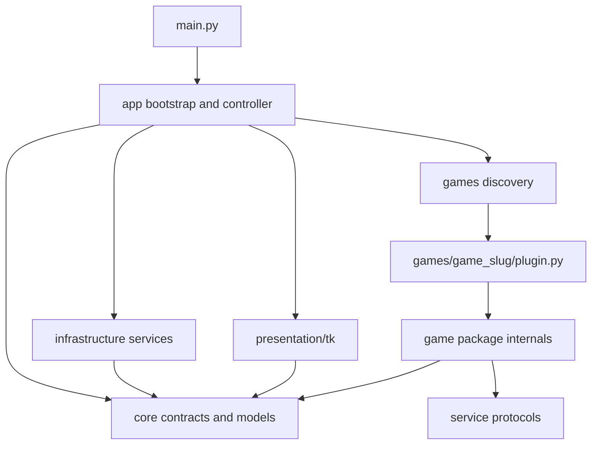

# Boundary Solidification Plan

Status: migration started

Implemented in the first slice:

- dependency-free core RA and snapshot/protocol models with compatibility re-exports
- shared keyring credential store under `infrastructure`
- Tk API-key prompt under `presentation/tk`
- RA HTTP/config implementation under `infrastructure`
- validated sibling-folder plugin discovery with isolated failures
- architecture tests for the first game/core import rules
- hash-driven, public-Web-API achievement research export with offline saved-page memory-note import

Still pending: moving the real game packages and assets, switching production bootstrap to discovery, generic map documents, controller/UI separation, and removal of compatibility modules.

## Goal

Turn RetroArch Overlay into a stable application harness around self-contained game packages.

The defining acceptance rule is:

> Adding a built-in game requires one new sibling folder under `src/retroarch_overlay/games/` and no edits to `main.py`, shared UI code, the registry, packaging configuration, or a central game list.

All source-controlled game knowledge must live in that folder. This includes ROM identity, RAM addresses, state decoders, achievement IDs, progression rules, maps, images, patches, fixtures, and game-specific setup options.

## Architectural Decisions

1. Rename the game extension area from `adapters/` to `games/`. A game package is a complete vertical slice, not only a memory adapter.
2. Discover built-in games by scanning sibling packages under `retroarch_overlay.games`. Do not maintain named imports or a central registry list.
3. Import only each game's lightweight `plugin.py` during discovery. Construct the adapter lazily after its manifest matches the running content.
4. Keep all communication between a game and the application in shared, immutable data contracts.
5. Keep Tk, sockets, HTTP, keyring, filesystem search, and command-line parsing out of game domain modules.
6. Keep every source-controlled asset inside the owning game package and load it with `importlib.resources`.
7. Treat large external source trees, such as `pokeemerald`, as optional providers rather than application source.
8. A missing or broken optional game must not prevent other games from starting.
9. Preserve compatibility imports during migration, then remove them after all callers use the new package paths.
10. Enforce these boundaries with automated architecture tests rather than relying only on documentation.

## Target Dependency Direction



The following imports are forbidden:

- `core` importing `app`, `infrastructure`, `presentation`, or `games`.
- `infrastructure` importing `presentation` or any game package.
- `presentation` importing a named game package.
- `app` importing a named game package.
- One game package importing another game package.
- A game package importing Tk, Pillow, keyring, socket, or HTTP clients.
- Shared code containing a path to a named game's assets.

## Target Project Layout

```text
src/retroarch_overlay/
    __init__.py
    main.py

    app/
        __init__.py
        bootstrap.py
        controller.py
        options.py
        diagnostics.py

    core/
        __init__.py
        contracts.py
        errors.py
        models.py
        presentation.py

    infrastructure/
        __init__.py
        content_hashes.py
        retroarch.py
        retroachievements.py
        credentials.py
        app_paths.py

    presentation/
        __init__.py
        tk/
            __init__.py
            overlay.py
            details.py
            maps.py
            credentials.py

    games/
        __init__.py
        discovery.py

        dragon_warrior_3/
            __init__.py
            plugin.py
            manifest.py
            adapter.py
            state.py
            memory.py
            presenter.py
            tracker.py
            achievements.py
            knowledge.py
            data/
                locations.json
                progression.json
            assets/
                maps/
                    world.png
                    underworld.png
                    SOURCE.md
            tests/
                test_memory.py
                test_presenter.py
                test_plugin.py
                fixtures.py

        emerald/
            __init__.py
            plugin.py
            manifest.py
            adapter.py
            state.py
            memory.py
            presenter.py
            tracker.py
            achievements.py
            battle.py
            feebas.py
            decomp.py
            knowledge.py
            decomp.lock.json
            data/
            assets/
                patches/
                    professor_oak_challenge/
            tests/
                test_memory.py
                test_presenter.py
                test_battle.py
                test_feebas.py
                test_plugin.py
                fixtures/

tests/
    architecture/
        test_dependencies.py
        test_game_discovery.py
        test_game_package_contract.py
        test_packaged_assets.py
    app/
    infrastructure/
    presentation/
```

Not every game must use every optional file. The folder contract defines responsibilities, not mandatory empty modules.

## Shared Boundary Responsibilities

### Core

`core` contains only stable types and protocols:

- `RetroArchStatus`
- `MemoryReader`
- `GameManifest`
- `GamePlugin`
- `GameAdapter`
- `GameContext`
- `GameOptionSpec`
- `OverlaySnapshot`
- `PanelSection`
- `PanelRow`
- action and detail document models
- generic map document models
- typed application errors

Core must depend only on the Python standard library. It cannot know which games exist.

### Application

`app` coordinates the program:

- discovers plugins
- builds the generic command-line parser
- resolves shared and plugin-declared settings
- starts infrastructure services
- polls RetroArch
- selects and caches the matching game adapter
- converts exceptions into diagnostic events
- sends immutable render models to the UI

The polling thread currently inside `OverlayWindow` moves to `app/controller.py`. The Tk renderer should receive events and render them; it should not own sockets, registry selection, or retry policy.

### Infrastructure

`infrastructure` implements external I/O:

- RetroArch UDP commands and memory reads
- ROM hashing and filesystem search
- RetroAchievements HTTP calls
- credential persistence
- operating-system data/cache paths

Infrastructure implements core protocols. It must not contain game IDs, ROM hashes, memory offsets, game-specific asset paths, or progression rules.

### Presentation

`presentation/tk` renders generic documents:

- overlay snapshots
- section actions
- detail documents
- generic image maps
- diagnostics and setup status
- credential prompts

The renderer may style a semantic state such as `alert`, `complete`, or `unavailable`. It must not branch on a game slug, game title, map ID, item ID, or achievement ID.

### Games

Each `games/<slug>/` package owns one game's complete behavior and source-controlled data. It may import core contracts and service protocols, but not service implementations or Tk widgets.

## Game Package Contract

### Required Files

Each game folder must contain:

- `__init__.py`: empty or a minimal public re-export.
- `plugin.py`: the only module loaded by generic discovery.
- `manifest.py`: lightweight identity and capability metadata.
- `adapter.py`: orchestration between memory decoding, tracking, and presentation.
- `tests/test_plugin.py`: contract and construction tests.

### Optional Responsibility Modules

- `state.py`: immutable typed state objects.
- `memory.py`: RAM/SRAM addresses, validation, and byte decoding.
- `presenter.py`: game state plus knowledge to shared presentation documents.
- `tracker.py`: differences between snapshots and session-only observations.
- `knowledge.py`: small authored facts represented as typed Python data.
- `achievements.py`: achievement catalog and game-specific detectors.
- `data/`: larger authored JSON or binary tables.
- `assets/`: maps, patches, images, and source/license metadata.
- `tests/fixtures/`: compact memory and external-data fixtures.

### Internal Dependency Direction

```text
plugin -> adapter -> memory -> state
                  -> tracker -> state
                  -> presenter -> state + knowledge + core presentation models
knowledge -> data files
presenter -> achievements
```

`memory.py` must not produce display strings or `PanelSection` objects. `presenter.py` must not read raw memory. `knowledge.py` must not perform network or emulator I/O. `adapter.py` should coordinate these pieces and remain small.

## Plugin Contract

The exact names may change during implementation, but the semantic contract should be equivalent to:

```python
@dataclass(frozen=True, slots=True)
class GameManifest:
    slug: str
    display_name: str
    ra_game_id: int | None
    supported_cores: frozenset[str]
    content_hints: tuple[str, ...]
    content_hashes: frozenset[str]
    capabilities: frozenset[str]


class GamePlugin(Protocol):
    manifest: GameManifest
    options: tuple[GameOptionSpec, ...]

    def supports(
        self,
        status: RetroArchStatus,
        content_hash: str | None,
    ) -> bool: ...

    def create(
        self,
        context: GameContext,
        settings: Mapping[str, object],
    ) -> GameAdapter: ...
```

Each game exports one module-level `PLUGIN` object from `plugin.py`.

Rules for `plugin.py`:

- Import must be cheap and side-effect free.
- Do not read game data, contact RA, inspect ROM directories, or construct the adapter at import time.
- Import heavy game internals inside `create()`.
- All CLI/config needs are declared through `options`.
- Option keys are namespaced by slug in the resolved settings map.

## Discovery and Adapter Lifecycle

1. `games.discovery` scans `retroarch_overlay.games.__path__` with `pkgutil.iter_modules`.
2. It ignores packages beginning with `_` and imports `<package>.plugin`.
3. It validates the exported `PLUGIN` and manifest.
4. It rejects duplicate slugs, conflicting option names, and invalid manifests.
5. The application asks each lightweight plugin whether it supports the active status/hash.
6. Only the matching plugin is constructed.
7. The constructed adapter is cached by slug for the process lifetime so session tracking survives polling.
8. If construction raises `GameUnavailableError`, the registry records the reason and continues operating.
9. A later retry can reconstruct the adapter after configuration or external data becomes available.

External Python packages can continue using entry points. Built-in folder discovery and third-party entry-point discovery should feed the same validated plugin catalog.

## Configuration Boundary

`main.py` must expose only application-wide options such as host, port, opacity, ROM roots, config path, and diagnostics.

Game options are declared inside each plugin with `GameOptionSpec`. The app translates those declarations into CLI arguments and resolved settings. For example, Emerald owns its decomp-root option; `main.py` does not contain `pokeemerald` or import `EmeraldAdapter`.

Configuration precedence should be:

1. explicit CLI option
2. environment variable
3. user configuration file
4. plugin default

Use stable namespaced keys such as `emerald.decomp_root`. Validate generic types in the application and game-specific semantics in the plugin.

## Presentation and Action Boundary

The current `PanelAction` is safe because it carries data rather than a callback, but `rows` is too narrow for maps and richer tools. Evolve it into a generic document action:

```text
PanelAction
    label
    document: DetailDocument | MapDocument

DetailDocument
    title
    sections

MapDocument
    title
    layers
    active_layer
    marker
    viewport
```

Games construct these shared documents. The Tk layer decides how to render them. Do not allow games to pass callables, Tk classes, or arbitrary widget factories through the contract.

The existing Dragon Warrior III map window must become a generic map renderer. The following currently game-specific UI facts move into the Dragon Warrior III package:

- world and underworld image references
- map titles
- coordinate transforms
- border calibration
- initial layer selection
- indoor-map fallback text, if it is game-specific

The generic renderer receives already-calculated marker and viewport data. It does not import the game package or inspect the game name.

## Game Data and Asset Policy

Game-specific data includes:

- memory addresses and bit masks
- item, monster, class, location, and map names
- ROM hashes and core/content aliases
- achievement IDs and descriptions
- route, progression, and unlock rules
- map coordinates and projection calibration
- decomp parsing rules
- images, patches, and source attribution
- test fixtures containing game-specific memory layouts

All of it belongs under `games/<slug>/`.

Specific moves:

- `resources/dragon_warrior_3/*` to `games/dragon_warrior_3/assets/maps/`.
- `resources/24186-PokemonEmerald-Subset-POC/*` to `games/emerald/assets/patches/professor_oak_challenge/`.
- Dragon Warrior III map loading and calibration out of `ui.py`.
- Emerald's `--pokeemerald-root` declaration out of `main.py`.
- All RA game IDs out of `main.py` and into manifests.
- Game-specific examples in shared protocol tests replaced with neutral example names.

Use `importlib.resources.files(package).joinpath(...)` through a shared asset resolver. Do not derive package resources from repository-relative paths.

Packaging configuration must use a generic package-data pattern that includes standardized `data/` and `assets/` contents for every game. Adding a game must not require a new `pyproject.toml` entry. A wheel-content test must verify that every plugin-declared asset is present after building and installing the wheel.

## External Data Policy

The full `pokeemerald` checkout should not be a mandatory submodule.

Recommended approach:

- Store a small `decomp.lock.json` in `games/emerald/` containing the expected repository URL, commit, and compatible data schema/version.
- Resolve an explicit `emerald.decomp_root` first.
- Otherwise use a generic application-data location supplied by `AppPaths`, such as `%LOCALAPPDATA%/RetroArchOverlay/sources/emerald/pokeemerald` on Windows.
- Validate required files and, when possible, the pinned commit.
- Keep compact checked-in fixtures under `games/emerald/tests/fixtures/` so normal tests do not require the full checkout.
- Mark full-decomp tests `external_data` and run them in a separate CI job.

A submodule remains an opt-in developer choice, but the application architecture must not depend on it. This keeps a missing Emerald provider from blocking Dragon Warrior III or any future game.

## RetroAchievements Boundary

Split the current combined RA module into:

- core `RAProgress` model and provider protocol
- infrastructure HTTP client
- infrastructure credential store
- Tk credential prompt

`GameContext` exposes a lazy `RAProgressProvider`. A plugin requests progress using its own manifest's `ra_game_id`. `main.py` must not call `load_ra_progress` once per named game.

Network failure returns typed unavailable/stale progress rather than failing adapter construction. Game achievement catalogs and local detector rules remain inside each game folder.

## Runtime and Error Boundary

Introduce typed errors:

- `GameUnavailableError`: required game provider or compatible data is missing.
- `UnsupportedContentError`: manifest matched weakly but content is not supported.
- `MemoryLayoutError`: required memory values are invalid for the expected game state.
- `AssetUnavailableError`: a declared packaged asset cannot be resolved.
- existing RetroArch transport/protocol errors remain infrastructure errors.

The application controller converts these into generic diagnostic models. The UI renders the diagnostics without knowing the game that produced them beyond manifest display text.

One broken game must never break discovery of its siblings. Discovery errors are collected and displayed in a diagnostics screen.

## Testing Strategy

### Harness Tests

Keep shared tests under top-level `tests/`:

- RetroArch protocol parsing
- hash resolution
- plugin discovery and duplicate detection
- controller polling/retry behavior
- generic action/detail/map rendering helpers
- credential and RA client behavior
- packaging and asset resolution

Use neutral fake game names in these tests.

### Colocated Game Tests

Move game-specific tests into each game package. Each game owns:

- memory decoder tests with byte fixtures
- presenter snapshot tests from typed state
- tracker transition tests
- manifest identity tests
- plugin construction and unavailable-provider tests
- knowledge consistency tests
- optional emulator/external-data integration tests

Presenter tests should not need an emulator. Memory tests should not construct UI sections. This makes failures identify the broken boundary.

### Architecture Tests

Add AST-based tests that fail when:

1. shared code imports `retroarch_overlay.games.<slug>` directly
2. one game imports another game
3. a game imports Tk, Pillow, keyring, socket, urllib, or requests
4. `main.py` contains named adapter construction
5. `presentation/` contains a named game asset path
6. a game folder lacks a valid `PLUGIN`
7. two manifests use the same slug
8. two plugins declare conflicting CLI options
9. a plugin performs forbidden work at import time
10. a declared package asset is absent

Also add a simple source scan for known current game names outside `games/`, with explicit exceptions for user-facing top-level documentation. AST rules are the primary enforcement; name scanning is a backstop.

### Test Markers

Define these markers:

- `unit`: no network, emulator, ROM, or external checkout
- `packaging`: builds/inspects an installed wheel
- `external_data`: requires a large optional source/data checkout
- `emulator`: requires RetroArch and a compatible ROM
- `network`: contacts a live service

The default CI job runs all tests except `external_data`, `emulator`, and `network`.

## Migration Plan

Every phase must leave the test suite runnable. Avoid a single large package move.

### Phase 0: Characterize Current Behavior

1. Add snapshot-level tests for current Emerald and Dragon Warrior III section ordering, actions, and diagnostics.
2. Add tests for the existing generic UI helpers.
3. Record the current full-suite result.
4. Add pytest markers for optional external data.
5. Add `git diff --check`, compile, and wheel build commands to the validation routine.

Exit criteria:

- Existing behavior is covered well enough to move files without guessing.
- Tests clearly distinguish unit coverage from missing emulator/decomp coverage.

### Phase 1: Introduce Core Contracts

1. Move shared dataclasses from `models.py` into `core/models.py` and `core/presentation.py`.
2. Move `MemoryReader`, `GameAdapter`, and new plugin protocols into `core/contracts.py`.
3. Add typed core errors.
4. Leave compatibility re-exports at the old paths.
5. Update shared tests to import the new paths.

Exit criteria:

- Old and new imports both work.
- Core imports only the standard library.
- Full tests pass.

### Phase 2: Add Folder Discovery and Lazy Construction

1. Create `games/discovery.py`.
2. Implement plugin and manifest validation.
3. Add lazy adapter construction and per-slug caching.
4. Continue accepting existing adapters in `AdapterRegistry` temporarily.
5. Add fake game packages in tests to prove discovery without a central list.
6. Test that one broken plugin does not hide valid plugins.

Exit criteria:

- A temporary test game is discovered solely because its folder exists.
- No real game needs to move yet.

### Phase 3: Move Dragon Warrior III as the Reference Slice

1. Create `games/dragon_warrior_3/`.
2. Move ROM identity into `manifest.py`.
3. Extract `GameState` and other immutable state into `state.py`.
4. Move RAM/SRAM constants and decoding into `memory.py`.
5. Move session achievement/item observations into `tracker.py`.
6. Move item, town, orb, route, unlock, and progression knowledge into `knowledge.py` or `data/`.
7. Move snapshot construction into `presenter.py`.
8. Reduce `adapter.py` to orchestration.
9. Move map assets and attribution into the game folder.
10. Introduce the generic map document and renderer.
11. Move DW3 tests beside the game.
12. Keep `adapters.dragon_warrior_3` as a temporary re-export.

Exit criteria:

- No Dragon Warrior III string, path, image, map transform, RA ID, or import remains in shared source.
- The battle and overworld tests pass without an emulator.
- Packaged map assets resolve from an installed wheel.

### Phase 4: Move Emerald

1. Create `games/emerald/`.
2. Move identity and RA metadata into the manifest.
3. Extract save-block and battle-memory parsing into `memory.py`.
4. Move decomp file parsing and validation into `decomp.py`.
5. Keep pure catch math in `battle.py`.
6. Separate pure Feebas seed/tile math from decomp tile loading.
7. Move route, collection, POC, and achievement presentation into `presenter.py`.
8. Move patch files and related documentation into Emerald assets.
9. Add compact decomp fixtures and replace broad skip-only coverage where practical.
10. Move the decomp option declaration into `plugin.py`.
11. Keep `adapters.emerald` as a temporary re-export.

Exit criteria:

- Shared source contains no Emerald adapter construction, decomp path, RA ID, patch path, or game-specific setup logic.
- Missing decomp data reports Emerald unavailable without preventing other games from running.
- Pure Emerald math and presenter tests run on a clean checkout.

### Phase 5: Make Bootstrap Game-Blind

1. Replace named imports in `main.py` with plugin discovery.
2. Build CLI options from shared options plus plugin declarations.
3. Replace per-game RA calls with the lazy provider in `GameContext`.
4. Resolve adapters only after content matching.
5. Add a diagnostics command or screen listing discovered, ready, and unavailable plugins.
6. Remove game names from `adapters/__init__.py`.

Exit criteria:

- Adding/removing a valid game folder changes discovery without changing shared code.
- Starting without Emerald external data still allows DW3 selection.

### Phase 6: Separate Controller, Infrastructure, and Tk

1. Move RetroArch transport to `infrastructure/retroarch.py`.
2. Move content hashing to `infrastructure/content_hashes.py`.
3. Split RA HTTP, credential storage, and credential UI.
4. Move polling, retry, and adapter selection from `OverlayWindow` to `app/controller.py`.
5. Have the controller publish snapshot or diagnostic events through a small protocol.
6. Split the Tk overlay, details, maps, and credentials into separate modules.

Exit criteria:

- UI tests use events/documents and do not need a RetroArch client.
- Controller tests use fake gateways and do not construct Tk.
- Games import only core contracts and protocols.

### Phase 7: Enforce and Package

1. Add all architecture tests.
2. Add a build-and-inspect wheel test.
3. Add generic package-data patterns for every game's standardized folders.
4. Add a game package template under a non-discovered `_template/` folder or a small scaffold command.
5. Document the one-folder game contribution workflow.
6. Run tests from both the source checkout and an installed wheel.

Exit criteria:

- Boundary violations fail CI.
- A sample game copied from the template is discovered with no shared edits.

### Phase 8: Remove Compatibility Layers

1. Update all imports to `core`, `infrastructure`, `presentation`, and `games` paths.
2. Remove old `adapters/`, root `models.py`, root `retroarch.py`, root `retroachievements.py`, and monolithic `ui.py` re-exports after a deprecation window.
3. Remove the top-level `resources/` directory once empty.
4. Search for stale named-game references in shared source.
5. Run the full architecture, unit, packaging, and optional-data suites.

Exit criteria:

- The target layout is the actual layout.
- No compatibility import remains.
- All acceptance criteria below pass.

## New Game Workflow After Migration

Adding a game should be:

1. Copy `games/_template/` to `games/<new_slug>/`.
2. Fill in the manifest and lightweight plugin.
3. Implement typed state and memory decoding.
4. Add authored knowledge and assets inside the folder.
5. Build shared presentation documents in the presenter.
6. Add colocated tests and fixtures.
7. Run the plugin contract and full unit suites.

No other production file should change. If adding a game requires editing `main.py`, `ui.py`, a central registry, or `pyproject.toml`, the extension boundary has failed.

## Acceptance Criteria

The migration is complete only when all are true:

- `main.py` imports no game package and contains no game-specific CLI option or RA ID.
- Shared presentation code imports no game package and contains no game asset path.
- Each built-in game is discovered from one sibling folder.
- Each game's code, authored data, assets, fixtures, and setup declaration are inside that folder.
- One game's import or construction failure does not block another game.
- Adapters are constructed lazily and cached per session.
- Games do not import Tk or infrastructure implementations.
- Raw memory decoding and snapshot presentation are separately testable.
- External Emerald data is optional and pinned by a small lock file.
- Generic detail and map documents cover game UI needs without callbacks.
- Core tests run without Pillow, keyring, RetroArch, a ROM, or `pokeemerald`.
- Wheels include every declared source-controlled game asset.
- Architecture tests enforce dependency direction and folder completeness.
- A sample new game can be added with one new folder and zero shared-code edits.

## Validation Commands

Use focused validation after each phase, then the full suite:

```powershell
python -m pytest tests/architecture
python -m pytest -m "not external_data and not emulator and not network"
python -m pytest
python -m compileall -q src
python -m build
git diff --check
```

External-data and emulator checks remain separate because they require resources that are not available on every development machine.

## Risks and Controls

### Dynamic discovery hides import failures

Control: collect every discovery error, expose it in diagnostics, and fail architecture tests for built-in plugin import errors.

### Plugin contracts become too broad

Control: keep the required plugin surface limited to identity, options, support matching, and construction. Add shared presentation models only when at least two games need the concept.

### Game packages begin shipping UI code

Control: prohibit UI imports and callbacks. Add generic immutable document variants instead.

### Generic maps become game-specific through flags

Control: games calculate map layers, marker positions, and viewports. The renderer only draws the supplied document.

### Packaged assets work from source but not wheels

Control: resolve assets only through `importlib.resources` and test an installed wheel.

### External data makes startup fragile

Control: lazy construction, typed unavailable results, compact unit fixtures, and independent plugin failure handling.

### Migration changes behavior while moving files

Control: characterize snapshots first, move one game at a time, preserve temporary re-exports, and rerun focused tests after every substantive edit.

## Recommended First Implementation Slice

The first implementation slice should be Phases 0 through 2 only:

1. Add architecture characterization tests.
2. Introduce core contracts with compatibility re-exports.
3. Implement lightweight folder discovery against fake test games.
4. Add lazy construction and unavailable-plugin diagnostics.

That slice proves the extension boundary before moving hundreds of lines. Dragon Warrior III should then be the first real game moved because it has no external decomp dependency and its fake-memory coverage is already strong.